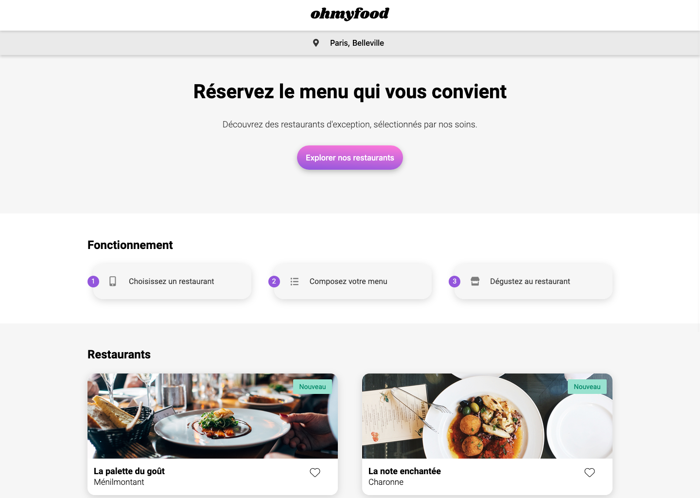
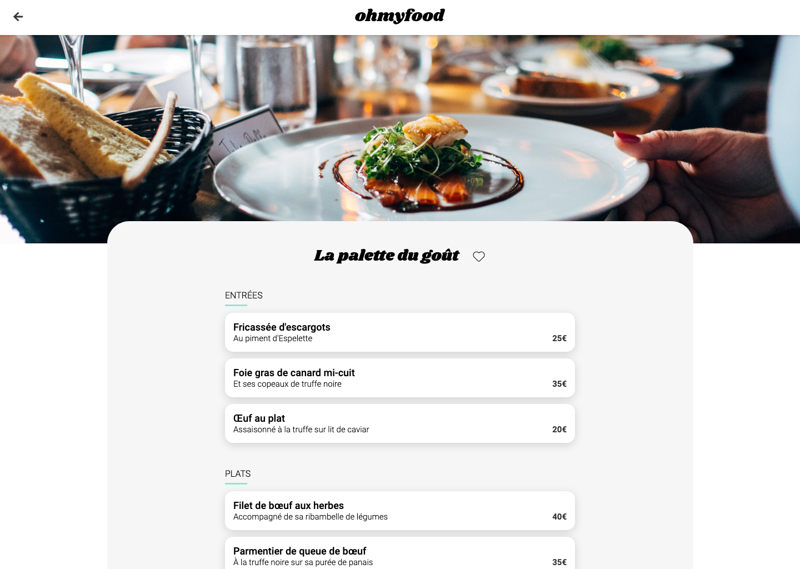
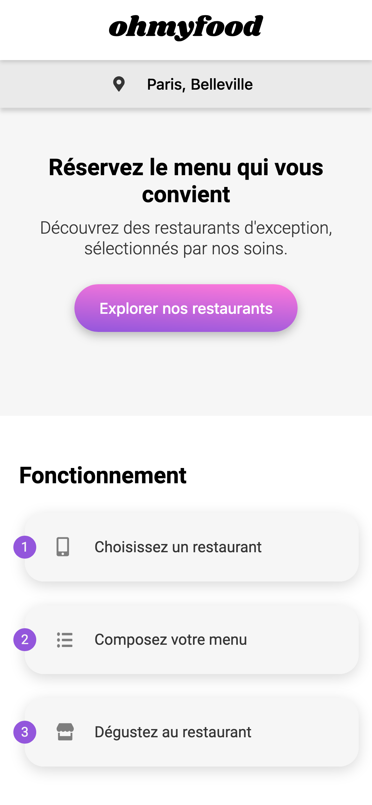
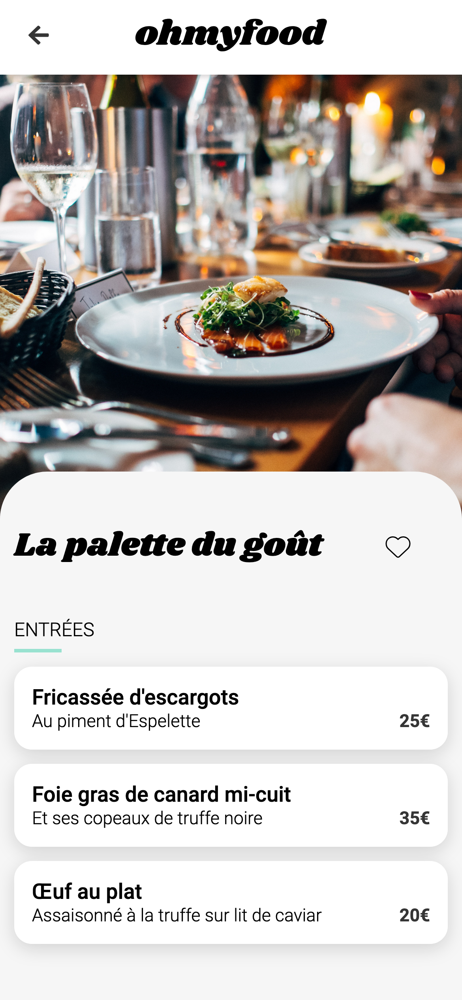

# Open Classrooms - Project 3 Oh My Food

## 📌 Description

Source code of **Project 3 - Oh My Food**: *Animate a webpage with CSS animations*, completed as part of the **OpenClassrooms JavaScript React Developer path**.  

⚠️ **Educational project**: This repository was created for learning purposes during my training. It is **not intended for production use**.

---

## 🎯 Learning Objectives

- Implement advanced CSS visual effects
- Maintain visual consistency throughout a website
- Set up a website navigation structure
- Set up a Front-End development environment
- Use a version control system for project tracking and deployment

---

## 🔗 Provided Resources

- [Creative brief](https://course.oc-static.com/projects/D%C3%A9veloppeur+Web/IW_P4+Animations+CSS+Ohmyfood/Brief+cr%C3%A9atif+site+Ohmyfood.pdf)
- [Design template on Figma](https://www.figma.com/design/t4449fzDnwGYmzuwQdu87V/Maquettes-Ohmyfood--mobile-et-desktop-?node-id=0-1)
- [Interactive prototype on Figma](https://www.figma.com/proto/t4449fzDnwGYmzuwQdu87V/Maquettes-Ohmyfood--mobile-et-desktop-?node-id=25368-591&scaling=scale-down&page-id=0%3A1&starting-point-node-id=25368%3A591&show-proto-sidebar=1)
- [Source files (images and texts)](https://course.oc-static.com/projects/D%C3%A9veloppeur+Web/IW_P4+Animations+CSS+Ohmyfood/Images+et+textes+Ohmyfood.zip)

---

## 👀 Preview

| Home Page                                                         | Restaurant Page                                                           |
|-------------------------------------------------------------------|---------------------------------------------------------------------------|
|  |  |
|     |     |

🔗 [Live preview](https://sedomu.github.io/oc_p3_ohmyfood/)

---

## 🏗 Project structure

- `index.html` → Entry point (home page)
- `restaurants.html` → Restaurants pages
- `assets/` → Images, icons, fonts and css stylesheet compiled from Sass

---

## 🛠 Tech stack

- HTML5
- Sass
- CSS animations

No JavaScript or external libraries were used.

---

## ✅ Code validation
The HTML and CSS code was validated using the official [W3C Markup Validator](https://validator.w3.org/nu/?doc=https%3A%2F%2Fsedomu.github.io%2Foc_p3_ohmyfood%2Findex.html) and [W3C CSS Validator](https://jigsaw.w3.org/css-validator/validator?uri=https%3A%2F%2Fsedomu.github.io%2Foc_p3_ohmyfood%2Findex.html&profile=css3svg&usermedium=all&warning=1&vextwarning=&lang=fr).
No errors were reported.

---

## ⚙️ Installation

### 📋 Requirements
- None (this project only requires a web browser)

### 🚀 Steps
Clone the repository:

```bash
git clone https://github.com/sedomu/oc_p3_ohmyfood.git
```

Then simply open the file `index.html` in your web browser:

```bash
open ./index.html
```

### 🤖 Deployment
This project is automatically deployed to GitHub Pages via a GitHub Actions workflow.
No manual deployment steps are required.

---

## 📜 Scripts available
Not applicable – no build tools or package managers are needed for this project.

---

## ⚠️ Disclaimer
This is a **training project** created as part of the OpenClassrooms curriculum.  
Some implementations (e.g., accessibility, performance optimization, authentication) are simplified and may not meet production standards.